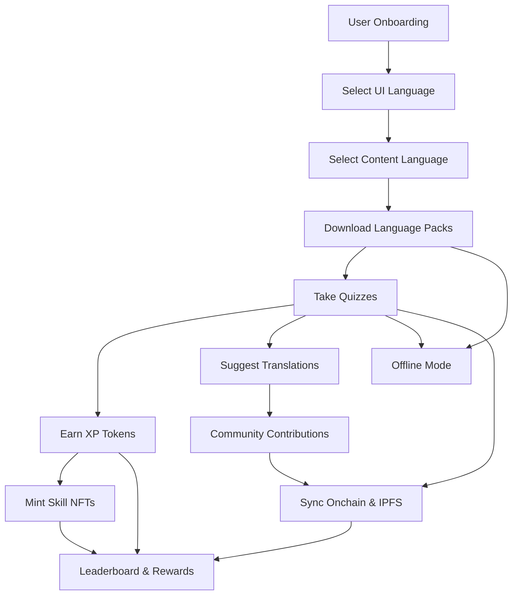

# ScholarForge

## Architecture Diagram



## Project Vision
ScholarForge is a fully onchain Web3 learning app where students:
- Learn through quizzes in African languages
- Earn XP Tokens (ERC20) and Skill NFTs (ERC721)
- Progress through gamified learning levels
- Build onchain credentials
- Play offline and sync when online
- Are rewarded based on real community contributions

## Core Smart Contracts

### XPToken (ERC20)
- Earned for quiz performance
- Only QuizMasters can mint XP
- Pausable for security
- Custom events for off-chain gamification
- Extensible for tipping, staking, and more

### SkillNFT (ERC721)
- Minted after topic mastery
- Only QuizMasters can mint
- Skill/level metadata per NFT
- Batch minting supported
- Pausable for security
- Custom events for achievements

## Setup Instructions

1. **Clone the repo**
2. **Install dependencies:**
   ```bash
   npm install
   ```
3. **Compile contracts:**
   ```bash
   npx hardhat compile
   ```
4. **Run tests:**
   ```bash
   npx hardhat test
   ```
5. **Deploy to testnet:**
   - Configure your `.env` and `hardhat.config.js` for EduChain or your target network.
   - Use Hardhat scripts to deploy.

## Contribution Guidelines
- All smart contract and backend logic should be written in VSCode.
- Use best practices: OpenZeppelin, AccessControl, Pausable, and NatSpec comments.
- Write and run tests for every feature.
- Document your code and update this README as needed.

## Tech Stack
- Solidity (OpenZeppelin)
- Hardhat
- Node.js
- EduChain (Open Campus)
- IPFS / Web3.Storage (for quiz & proof data)

---

For questions, open an issue or contact the team lead.