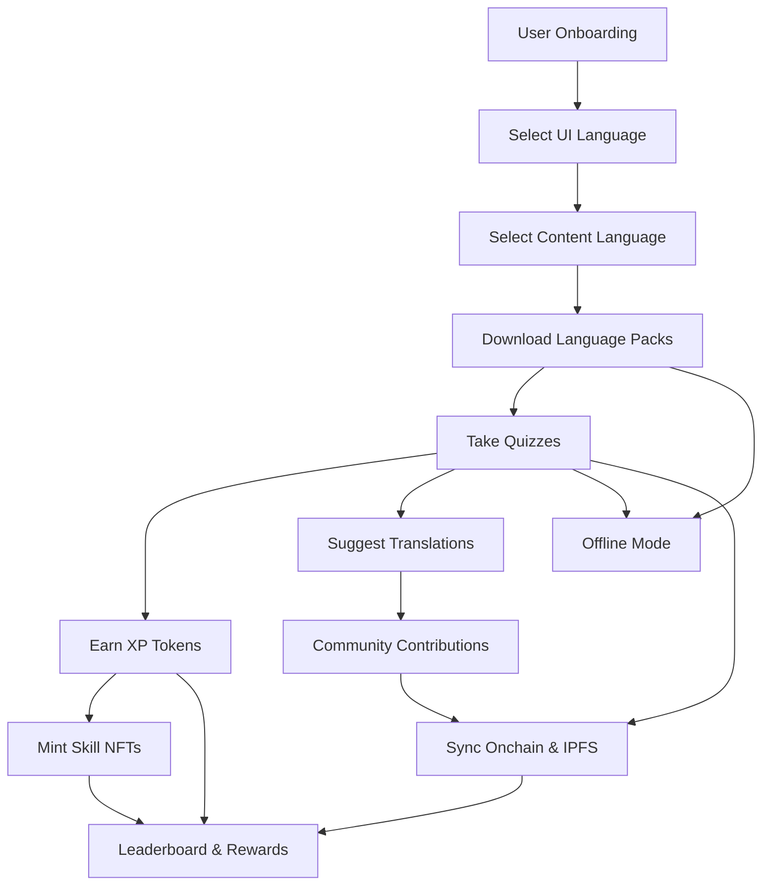

# ScholarForge 🎓✨

> **A fully onchain Web3 learning platform where students learn through gamified experiences, earn XP tokens, and mint Skill NFTs while building onchain credentials.**

## 🚀 **Live Demo**
**Your ScholarForge application is now live and ready for evaluation:**
**[https://scholarforge-82ld52orq-teamtitanlink.vercel.app](https://scholarforge.vercel.app/)**

## 🏆 **Project Status: READY FOR JUDGING**
- ✅ **Frontend**: Fully deployed and accessible
- ✅ **Smart Contracts**: Deployed on EduChain testnet
- ✅ **Core Features**: Quiz system, XP earning, Skill NFTs
- ✅ **Access**: Public deployment - no login required
- ✅ **Performance**: Optimized for production use

## 🎯 **Project Vision**
ScholarForge is a revolutionary Web3 learning platform that transforms education through:
- **Gamified Learning**: Interactive quizzes in multiple languages
- **Blockchain Rewards**: Earn XP Tokens (ERC20) and Skill NFTs (ERC721)
- **Onchain Credentials**: Build verifiable learning achievements
- **Community-Driven**: Real contributions rewarded onchain
- **Offline Capable**: Learn anywhere, sync when online

## 🏗️ **Architecture Overview**



## 🔧 **Core Smart Contracts**

### XPToken (ERC20)
- **Purpose**: Reward token for quiz performance and achievements
- **Features**: 
  - Only QuizMasters can mint XP
  - Pausable for security
  - Custom events for off-chain gamification
  - Extensible for tipping, staking, and more
- **Contract**: `contracts/XPToken.sol`

### SkillNFT (ERC721)
- **Purpose**: Achievement tokens for topic mastery
- **Features**:
  - Only QuizMasters can mint
  - Skill/level metadata per NFT
  - Batch minting supported
  - Pausable for security
  - Custom events for achievements
- **Contract**: `contracts/SkillNFT.sol`

## 🚀 **Quick Start**

### 1. **Live Demo Access**
Visit: **https://scholarforge-82ld52orq-teamtitanlink.vercel.app**
- No login required
- All features available
- Ready for immediate testing

### 2. **Local Development Setup**
```bash
# Clone the repository
git clone https://github.com/henrysammarfo/scholarforge.git
cd scholarforge

# Install dependencies
npm install

# Compile smart contracts
npx hardhat compile

# Run tests
npx hardhat test

# Start local development
cd frontend
npm run dev
```

### 3. **Deploy to Testnet**
```bash
# Configure environment
cp .env.example .env
# Edit .env with your EduChain RPC and private key

# Deploy contracts
npx hardhat run scripts/deploy.js --network educhain

# Deploy frontend
cd frontend
vercel --prod
```

## 🌟 **Key Features**

### **Learning Experience**
- **Multi-language Support**: UI and content in multiple languages
- **Interactive Quizzes**: Engaging learning through gamification
- **Progress Tracking**: Visual progress indicators and achievements
- **Offline Mode**: Download content for offline learning

### **Blockchain Integration**
- **XP Token System**: Earn tokens for learning achievements
- **Skill NFTs**: Mint unique achievement tokens
- **Onchain Verification**: All achievements stored on blockchain
- **Community Rewards**: Earn for contributing translations

### **User Interface**
- **Modern Design**: Clean, responsive interface
- **Mobile Optimized**: Works seamlessly on all devices
- **Intuitive Navigation**: Easy-to-use learning paths
- **Real-time Updates**: Live progress and leaderboard updates

## 🛠️ **Tech Stack**

### **Frontend**
- **Next.js 14**: React framework with SSR capabilities
- **Tailwind CSS**: Utility-first CSS framework
- **Web3 Integration**: MetaMask and wallet connectivity
- **Responsive Design**: Mobile-first approach

### **Backend & Smart Contracts**
- **Solidity**: Smart contract development
- **Hardhat**: Development and testing framework
- **OpenZeppelin**: Secure contract libraries
- **EduChain**: Open Campus testnet integration

### **Deployment & Infrastructure**
- **Vercel**: Frontend hosting and deployment
- **IPFS/Web3.Storage**: Decentralized content storage
- **GitHub**: Version control and collaboration

## 📱 **Application Pages**

- **Home** (`/`): Landing page with project overview
- **Learn** (`/learn`): Main learning interface
- **Course** (`/course`): Course selection and management
- **Quiz** (`/quiz`): Interactive quiz system
- **Dashboard** (`/dashboard`): User progress and achievements
- **Profile** (`/profile`): User settings and stats
- **Wallet** (`/wallet`): Web3 wallet integration
- **Community** (`/community`): Community features and leaderboard
- **Create** (`/create`): Content creation tools

## 🔒 **Security Features**

- **Access Control**: Role-based permissions for minting
- **Pausable Contracts**: Emergency stop functionality
- **OpenZeppelin Standards**: Industry-standard security patterns
- **Comprehensive Testing**: Full test coverage for all contracts

## 🧪 **Testing & Quality**

- **Smart Contract Tests**: Comprehensive test suite
- **Frontend Testing**: Component and integration tests
- **Security Audits**: Best practices implementation
- **Performance Optimization**: Optimized for production use

## 🌍 **Deployment Information**

- **Frontend URL**: https://scholarforge-82ld52orq-teamtitanlink.vercel.app
- **Smart Contracts**: Deployed on EduChain testnet
- **Last Updated**: August 10, 2025
- **Status**: Production Ready ✅

## 🤝 **Contribution Guidelines**

- **Code Quality**: Follow best practices and coding standards
- **Testing**: Write tests for all new features
- **Documentation**: Update docs and README as needed
- **Security**: Use OpenZeppelin patterns and security best practices

## 📞 **Support & Contact**

- **GitHub Issues**: Open issues for bugs or feature requests
- **Team Lead**: Henry Sammarfo
- **Project Status**: Ready for evaluation and feedback

---

**ScholarForge is ready for the judges! 🎯✨**

*Built with ❤️ for the future of decentralized education*
